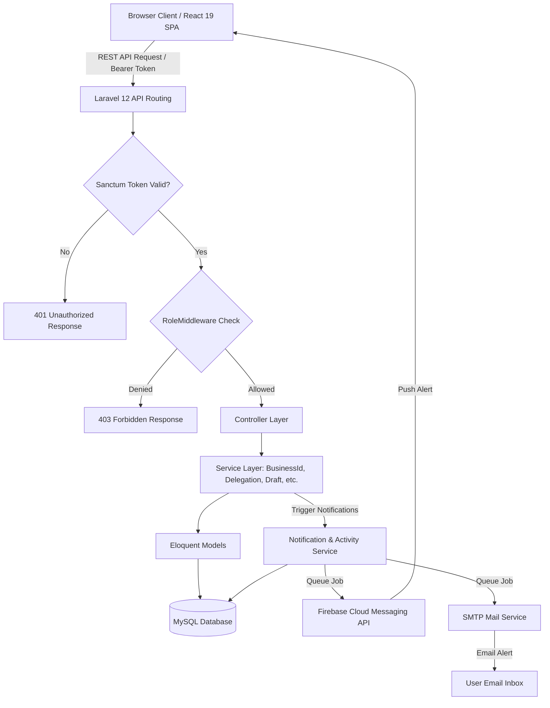
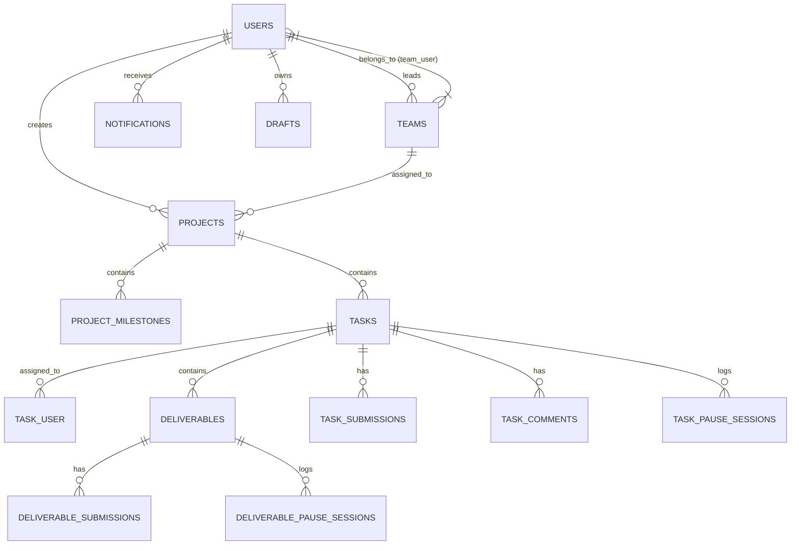

# Software Requirements Specification (SRS)
## Techxaro PMS — Project Management System

**Document Version:** 2.1.0  
**Date:** July 29, 2026  
**Author:** Lead Software Architect & Engineering Team  
**Status:** Approved / Release Baseline  

---

## Clickable Table of Contents

- [1. Document Information](#1-document-information)
  - [1.1 Purpose](#11-purpose)
  - [1.2 Intended Audience](#12-intended-audience)
  - [1.3 Scope](#13-scope)
  - [1.4 Revision History](#14-revision-history)
- [2. Project Overview](#2-project-overview)
  - [2.1 Business Context & Objectives](#21-business-context--objectives)
  - [2.2 Target Users](#22-target-users)
  - [2.3 Core Functional Modules](#23-core-functional-modules)
  - [2.4 High-Level Architecture Summary](#24-high-level-architecture-summary)
- [3. Technology Stack](#3-technology-stack)
  - [3.1 Backend Stack](#31-backend-stack)
  - [3.2 Frontend Stack](#32-frontend-stack)
  - [3.3 Infrastructure & Third-Party Services](#33-infrastructure--third-party-services)
- [4. System Architecture](#4-system-architecture)
  - [4.1 High-Level Architectural Diagram](#41-high-level-architectural-diagram)
  - [4.2 Frontend Architecture](#42-frontend-architecture)
  - [4.3 Backend Architecture](#43-backend-architecture)
  - [4.4 Directory Structure](#44-directory-structure)
  - [4.5 API Communication Protocol](#45-api-communication-protocol)
  - [4.6 Authentication Flow](#46-authentication-flow)
  - [4.7 Request Lifecycle](#47-request-lifecycle)
- [5. User Roles and Permissions](#5-user-roles-and-permissions)
  - [5.1 Admin Role](#51-admin-role)
  - [5.2 Manager Role](#52-manager-role)
  - [5.3 Team Lead Role](#53-team-lead-role)
  - [5.4 Member Role](#54-member-role)
  - [5.5 Guest Role (Client Portal)](#55-guest-role-client-portal)
  - [5.6 Access Control Matrix](#56-access-control-matrix)
- [6. Functional Requirements](#6-functional-requirements)
  - [6.1 Authentication & Profile Management](#61-authentication--profile-management)
  - [6.2 Role-Based Dashboards](#62-role-based-dashboards)
  - [6.3 User Management & Employee Profiles](#63-user-management--employee-profiles)
  - [6.4 Team Management](#64-team-management)
  - [6.5 Project Management & Milestones](#65-project-management--milestones)
  - [6.6 Task Management](#66-task-management)
  - [6.7 Deliverable / Subtask Management](#67-deliverable--subtask-management)
  - [6.8 Review & Workflow Engine](#68-review--workflow-engine)
  - [6.9 Delegation System](#69-delegation-system)
  - [6.10 Work Timer & Pause Sessions](#610-work-timer--pause-sessions)
  - [6.11 Unified Calendar & Custom Events](#611-unified-calendar--custom-events)
  - [6.12 Notifications System (In-App & Push)](#612-notifications-system-in-app--push)
  - [6.13 Reporting, Analytics & PDF Export](#613-reporting-analytics--pdf-export)
  - [6.14 Draft Management Center](#614-draft-management-center)
  - [6.15 Audit Logging & Activity Tracking](#615-audit-logging--activity-tracking)
  - [6.16 Chat & Project Messaging](#616-chat--project-messaging)
  - [6.17 Task & Subtask Discussions (Comments)](#617-task--subtask-discussions-comments)
  - [6.18 Project & Task Access Credentials](#618-project--task-access-credentials)
  - [6.19 Company Documents Management](#619-company-documents-management)
- [7. Business Rules](#7-business-rules)
  - [7.1 Business ID Formatting Rules](#71-business-id-formatting-rules)
  - [7.2 Workflow State Transitions](#72-workflow-state-transitions)
  - [7.3 Delegation Rules](#73-delegation-rules)
  - [7.4 Work Timer & Lock Rules](#74-work-timer--lock-rules)
  - [7.5 First-Time Login Password Policy](#75-first-time-login-password-policy)
  - [7.6 User Resignation Impact & Reassignment Rules](#76-user-resignation-impact--reassignment-rules)
  - [7.7 Visibility & Data Isolation Rules](#77-visibility--data-isolation-rules)
  - [7.8 Draft Publishing & Versioning Rules](#78-draft-publishing--versioning-rules)
- [8. Database Design](#8-database-design)
  - [8.1 Entity Relationship Diagram (ERD)](#81-entity-relationship-diagram-erd)
  - [8.2 Database Tables & Schema Specifications](#82-database-tables--schema-specifications)
- [9. API Documentation](#9-api-documentation)
  - [9.1 Public Routes](#91-public-routes)
  - [9.2 Authentication & Profile API](#92-authentication--profile-api)
  - [9.3 Dashboard API](#93-dashboard-api)
  - [9.4 User Management API](#94-user-management-api)
  - [9.5 Team Management API](#95-team-management-api)
  - [9.6 Project Management API](#96-project-management-api)
  - [9.7 Task Management API](#97-task-management-api)
  - [9.8 Deliverable API](#98-deliverable-api)
  - [9.9 Calendar API](#99-calendar-api)
  - [9.10 Notification & Push Token API](#910-notification--push-token-api)
  - [9.11 Chat API](#911-chat-api)
  - [9.12 Report API](#912-report-api)
  - [9.13 Draft API](#913-draft-api)
  - [9.14 Audit Log API](#914-audit-log-api)
- [10. Frontend Pages Overview](#10-frontend-pages-overview)
  - [10.1 Page Routing & Access Controls](#101-page-routing--access-controls)
  - [10.2 Page Breakdown Specifications](#102-page-breakdown-specifications)
- [11. Validation Rules](#11-validation-rules)
- [12. Security Requirements](#12-security-requirements)
- [13. Non-Functional Requirements](#13-non-functional-requirements)
- [14. Email System](#14-email-system)
- [15. File Storage](#15-file-storage)
- [16. Error Handling](#16-error-handling)
- [17. Configuration Requirements](#17-configuration-requirements)
- [18. Deployment Guide](#18-deployment-guide)
- [19. External Integrations](#19-external-integrations)
- [20. Known Limitations](#20-known-limitations)
- [21. Future Enhancements](#21-future-enhancements)
- [22. Glossary](#22-glossary)
- [23. Appendix](#23-appendix)

---

## 1. Document Information

### 1.1 Purpose
This Software Requirements Specification (SRS) document provides a complete, authoritative technical specification for the **Techxaro Project Management System (PMS)**. It details all system capabilities, architectural patterns, database schemas, REST APIs, frontend components, workflow state machines, and business logic derived directly from the project's source codebase.

### 1.2 Intended Audience
- **Software Engineers & Developers:** To understand system architecture, data models, business rules, and API endpoints for ongoing development and maintenance.
- **QA Engineers & Testers:** To formulate comprehensive test plans, validation criteria, and end-to-end test cases based on defined functional requirements and business rules.
- **System Administrators & DevOps:** To configure environments, manage cPanel/Web host deployments, set up database migrations, cron workers, and push notification services.
- **Project Managers & Executives:** To audit implementation scope, review role permissions, and plan future system releases.

### 1.3 Scope
Techxaro PMS is an enterprise-grade project management application designed for technology and agency organizations. It unifies project planning, milestone tracking, task breakdown, subtask/deliverable execution, user performance analytics, client guest interactions, and HR employee management into a single web application.

### 1.4 Revision History

| Version | Date | Description | Author |
|---|---|---|---|
| **1.0.0** | 2024-01-15 | Initial monolithic prototype release | Engineering Team |
| **2.0.0** | 2026-06-15 | Full separation into Laravel 12 API backend and React 19 SPA frontend | Lead Architect |
| **2.1.0** | 2026-07-29 | Integrated Business ID system (`PRJ-XXXX`, `TSK-XXXX`, `DEL-XXXX`), live work timer, draft management center, task delegation chain, FCM push notifications, client guest portal, and automated PDF reporting. | Engineering Team |

---

## 2. Project Overview

### 2.1 Business Context & Objectives
Prior to Techxaro PMS, operations relied on disparate spreadsheets, chat apps, and manual reporting. This resulted in lost task accountability, lack of real-time project progress visibility, unmonitored deadline slippage, and tedious manual HR/performance reporting.

Techxaro PMS solves these operational challenges by delivering:
1. **End-to-End Task Accountability:** Every project, task, and deliverable has an explicit creator, assigner, and assignee.
2. **Quality Control via State Machines:** Strict review workflows (`Submit` → `Approve` / `Reject` → `Reopen`) ensure deliverables are thoroughly inspected prior to task completion.
3. **Automated Metrics & PDF Reporting:** Real-time analytics on user completion velocity, overdue rates, milestone completion, and one-click PDF exports.
4. **Controlled Client Transparency:** Client guests can log in to view project milestones, deliverables, and communicate securely with project leads via dedicated chat channels without viewing internal employee data or HR records.

### 2.2 Target Users
- **System Administrators:** Executive leadership responsible for organization setup, global user accounts, role assignments, and system audit logs.
- **Project Managers:** Operational heads responsible for project initiation, client management, team formation, resource allocation, and performance oversight.
- **Team Leads:** Senior personnel managing day-to-day task distribution, approving submissions, delegating work, and guiding team execution.
- **Members / Employees:** Staff members executing assigned tasks, tracking work duration via active timers, submitting deliverables, and maintaining personal notes.
- **Guests / Clients:** External clients reviewing project progress, milestone completion, and communicating with internal project teams.

### 2.3 Core Functional Modules
1. **Authentication & Identity Access Management (IAM):** Sanctum token authentication, role guards, tab-isolated sessions, and first-time login security enforcement.
2. **Role-Tailored Dashboards:** Custom performance widgets, daily workload views, progress carousels, and real-time activity feeds for Admin, Manager, Team Lead, Member, and Guest roles.
3. **Project & Milestone Management:** Multi-team assignment, milestone achievement toggles, project access credential storage, file/link attachments, and visibility controls.
4. **Task & Subtask (Deliverable) Engine:** Standalone tasks, project-scoped tasks, recurring deliverable generators, business code auto-assignment, multi-user assignment, and drag-and-drop reordering.
5. **Workflow & Review State Engine:** Automated status transitions (`pending`, `in_progress`, `submitted`, `approved`, `rejected`, `reopened`, `completed`) with attachment & note audit logs.
6. **Task Delegation System:** Formal workflow allowing assignees to delegate tasks/deliverables with approval chains, transfer-back mechanisms, and delegation event logging.
7. **Live Work Timer & Pause Engine:** Real-time counter tracking elapsed work time, active/paused state tracking, pause session history logs, and assigner-initiated forced pauses.
8. **Unified Calendar:** Visual aggregation of tasks, deliverables, project deadlines, and color-coded custom events (meetings, workshops, company events).
9. **Draft Management Center:** Centralized drafting engine allowing users to auto-save, version, duplicate, and publish project/task drafts before publishing them live.
10. **In-App & Push Notification Hub:** Dual-channel alert delivery via internal database notifications and Firebase Cloud Messaging (FCM) push alerts.
11. **Performance Analytics & PDF Reporting:** Comprehensive stats breakdowns per employee, team, or project with styled jsPDF report generation.
12. **HR Employee Profile & Document Vault:** 40+ profile field management, employment details, bank data, and secure employee document storage.
13. **Project Messaging & Task Discussion:** Contextual project chat for guest-internal communication and comment threads with file attachments on tasks and subtasks.

### 2.4 High-Level Architecture Summary

```
 ┌──────────────────────────────────────────────────────────────────────────┐
 │                            REACT 19 FRONTEND                             │
 │   Single Page Application (SPA) - Vite 8 + Tailwind CSS 4 + Lucide Icons │
 │                                                                          │
 │  ┌───────────────┐   ┌────────────────────┐   ┌───────────────────────┐  │
 │  │ React Router  │   │  React Query 5     │   │ Context & EventBus    │  │
 │  │ (69 Routes)   │   │  (Cache & Sync)    │   │ (Toast, Auth, State)  │  │
 │  └───────┬───────┘   └─────────┬──────────┘   └───────────┬───────────┘  │
 └──────────┼─────────────────────┼──────────────────────────┼──────────────┘
            │                     │                          │
            └─────────────────────┼──────────────────────────┘
                                  │
                       HTTPS / REST API (JSON)
                    Authorization: Bearer <Sanctum Token>
                                  │
 ┌────────────────────────────────┼─────────────────────────────────────────┐
 │                            LARAVEL 12 BACKEND                            │
 │                                                                          │
 │  ┌────────────────────────────────────────────────────────────────────┐  │
 │  │  API Gateway & Routing (routes/api.php — 80+ REST Endpoints)       │  │
 │  ├────────────────────────────────────────────────────────────────────┤  │
 │  │  Middleware Layer (auth:sanctum, RoleMiddleware, EnsureNotGuest)    │  │
 │  ├────────────────────────────────────────────────────────────────────┤  │
 │  │  Controller Layer (24 Controllers) & Service Layer (9 Services)   │  │
 │  ├────────────────────────────────────────────────────────────────────┤  │
 │  │  Eloquent ORM Domain Models (41 Models)                            │  │
 │  └─────────────────────────────────┬──────────────────────────────────┘  │
 └────────────────────────────────────┼─────────────────────────────────────┘
                                      │
                 ┌────────────────────┴────────────────────┐
                 │                                         │
        ┌────────┴────────┐                       ┌────────┴────────┐
        │  MySQL Database │                       │ Local Storage / │
        │ (135 Migrations)│                       │ Mail / Firebase │
        └─────────────────┘                       └─────────────────┘
```

---

## 3. Technology Stack

### 3.1 Backend Stack
- **Language:** PHP 8.2+
- **Framework:** Laravel 12.x
- **Authentication:** Laravel Sanctum 4.3 (Bearer API Tokens)
- **Database ORM:** Eloquent ORM
- **Migration & Seeding Engine:** Laravel Database Migrations (135 schema migration files)
- **Dependency Manager:** Composer

### 3.2 Frontend Stack
- **UI Framework:** React 19.x
- **Build Tooling & Dev Server:** Vite 8.x
- **Client-Side Routing:** React Router 7.x
- **Styling & Design System:** Tailwind CSS 4.x + Vanilla CSS Utilities + Bootstrap 5 (select components)
- **Server State Management & Caching:** TanStack React Query 5.x
- **Rich Text Editing:** Quill Editor 2.x
- **Drag-and-Drop Library:** `@dnd-kit/core`, `@dnd-kit/sortable`, `@dnd-kit/utilities`
- **PDF Generation:** `jsPDF` + `jspdf-autotable`
- **Icons:** `Lucide React`, `React Icons` (Material, FontAwesome, Remix)

### 3.3 Infrastructure & Third-Party Services
- **Database System:** MySQL 5.7+ / 8.0+
- **Push Notification Service:** Firebase Cloud Messaging (FCM API v1) via `@firebase/messaging`
- **Email Delivery:** SMTP (Laravel Mailer with queued jobs)
- **Background Queue Worker:** Laravel Queue (`database` / `redis` driver)
- **File Storage System:** Local Filesystem (`storage/app/public`) symlinked to `public/storage`

---

## 4. System Architecture

### 4.1 High-Level Architectural Diagram



### 4.2 Frontend Architecture
The frontend is constructed as a React 19 Single Page Application (SPA) adhering to component-based modular design:
- **Routing Layer (`src/App.jsx`):** Configures 69 distinct routes split between public pages and protected route wrappers.
- **Route Guards (`src/components/ProtectedRoute.jsx`, `src/components/RoleProtectedRoute.jsx`):** Intercept route transitions to verify token presence, role permissions, and account active state.
- **API Client Layer (`src/lib/api.js`, `src/config/api.js`):** Encapsulates native `fetch` requests, appending `Authorization: Bearer <token>` and `Accept: application/json` headers. Includes global interceptors to auto-catch 401 unauthenticated states and trigger redirect to `/logged-out`.
- **State & Notification Context (`src/context/`):** Global providers managing toast notification stacks (`NotificationContext.jsx`) and screen overlay loading states (`LoadingContext.jsx`).
- **Data Fetching Hooks (`src/hooks/useApi.js`):** Wraps React Query (`useQuery`, `useMutation`) for caching, optimistic UI updates, and auto-invalidation on data changes.

### 4.3 Backend Architecture
The backend uses Laravel's Model-View-Controller (MVC) architecture augmented with an explicit Service Layer:
- **Controllers (`app/Http/Controllers/`):** 24 controllers responsible for request validation, authorization checks, invoking services, and returning formatted JSON responses.
- **Services (`app/Services/`):** Encapsulates multi-step domain logic:
  - `BusinessIdService.php`: Auto-generates unique sequential codes (`PRJ-0001`, `TSK-0001`, `DEL-0001`).
  - `DelegationService.php`: Handles complex multi-level task delegation logic, transfer-backs, and audit logging.
  - `DraftService.php`: Manages draft auto-saving, version snapshots, and publishing to main tables.
  - `ResignationWorkflowService.php`: Computes resignation impact, reassigns active tasks, and preserves draft states.
  - `NotificationService.php`: Dispatches dual-channel notifications (Database + FCM push + Email).
  - `ActivityService.php` & `AuditService.php`: Logs structural changes and security audit trails.
  - `RecurringService.php`: Processes recurring task templates and preview generation.
- **Middleware (`app/Http/Middleware/`):** Custom request filters handling role restriction (`RoleMiddleware`), guest write blocking (`EnsureNotGuest`), active account verification (`CheckUserStatus`), and SQL query profiling (`QueryLogMiddleware`).

### 4.4 Directory Structure

```
pms-techzaro/
├── backend/                        # Laravel 12 API Application
│   ├── app/
│   │   ├── Console/                # Artisan Commands (Draft cleanup, backfill)
│   │   ├── Http/
│   │   │   ├── Controllers/        # 24 REST API Controllers
│   │   │   └── Middleware/         # 6 Custom Security Middleware
│   │   ├── Jobs/                   # 4 Queued Background Jobs
│   │   ├── Mail/                   # 8 Mailable Notification Classes
│   │   ├── Models/                 # 41 Eloquent Domain Models
│   │   ├── Notifications/          # Notification Delivery Classes
│   │   ├── Providers/              # Service Providers
│   │   └── Services/               # 9 Core Business Logic Services
│   ├── config/                     # 14 Configuration Files
│   ├── database/
│   │   ├── migrations/             # 135 Schema Migration Files
│   │   └── seeders/                # Database Seeders
│   ├── routes/
│   │   └── api.php                 # 80+ REST API Endpoints
│   ├── storage/                    # Uploaded Document & File Storage
│   └── composer.json
│
└── frontend/                       # React 19 SPA Application
    ├── public/                     # Static Assets & Firebase Service Worker
    ├── src/
    │   ├── components/             # 30+ Shared & Layout UI Components
    │   ├── config/                 # API Endpoint Configuration
    │   ├── context/                # Toast & Loading State Providers
    │   ├── hooks/                  # React Query & Utility Hooks
    │   ├── lib/                    # API Client & Query Client Setup
    │   ├── pages/                  # 65 React Page Views & Modals
    │   ├── utils/                  # Auth, Date, EventBus, PDF Utilities
    │   ├── App.jsx                 # Client Router & Error Boundary
    │   └── main.jsx                # Application Entry Point
    ├── package.json
    ├── tailwind.config.js
    └── vite.config.js
```

### 4.5 API Communication Protocol
- **Format:** All requests and responses exchange JSON (`Content-Type: application/json`). File uploads use `multipart/form-data`.
- **Headers:** Protected requests must supply `Authorization: Bearer <sanctum_token>`.
- **Response Format:**
```json
{
  "success": true,
  "message": "Task updated successfully.",
  "data": { ... }
}
```

### 4.6 Authentication Flow
1. **Login Submission:** User posts credentials (`email`, `password`) to `POST /api/login`.
2. **Credential Verification:** `AuthController` validates credentials using `Hash::check`. If `active == 0`, login is rejected with HTTP 403.
3. **Token Generation:** Laravel Sanctum creates a plain-text API token (`$user->createToken('auth-token')->plainTextToken`).
4. **Session Hydration:** Frontend receives token, user role, and user profile data, saving the token to `localStorage.getItem('token')`.
5. **First-Time Change Password Check:** If `$user->must_change_password == 1`, frontend redirects immediately to the password update modal before allowing full system navigation.
6. **Per-Tab Isolation:** Token and role are stored per session state, supporting independent browser tab logins for multi-role testing.

### 4.7 Request Lifecycle

```
[React View Event] 
       │
       ▼
[useApiMutation / customFetch] ─── (Add Bearer Header) ───► [HTTP GET/POST/PUT/DELETE]
                                                                     │
                                                                     ▼
[Response Status Check] ◄── [Return JSON] ◄── [Controller Process] ◄── [RoleMiddleware & Auth Guard]
       │
       ├── Status 200: Update React Query Cache -> Show Toast Success Notification
       ├── Status 401: Clear Storage -> Redirect to /logged-out
       └── Status 422: Parse Validation Error Array -> Highlight Input Form Fields
```

---

## 5. User Roles and Permissions

### 5.1 Admin Role
- **Description:** Highest privilege level representing executive management or system administrators.
- **Permissions:** Unrestricted CRUD across all modules (Users, Teams, Projects, Tasks, Deliverables, Reports, Audit Logs, Credentials, Drafts).
- **Accessible Pages:** All 25+ frontend pages including `/admin/manage-users`, `/admin/manage-team`, `/admin/audit-logs`, `/admin/drafts`.
- **Restrictions:** None.

### 5.2 Manager Role
- **Description:** Operations and project managers overseeing multiple teams and projects.
- **Permissions:** Full management of users, teams, projects, tasks, and deliverables. Can generate company-wide reports and manage company documents.
- **Accessible Pages:** All system pages except admin-only password management (`/users/{id}/admin-change-password`).
- **Restrictions:** Cannot change user passwords directly without admin elevation.

### 5.3 Team Lead Role
- **Description:** Operational leads managing dedicated teams and project execution.
- **Permissions:** Create/edit tasks and deliverables within assigned projects/teams. Approve or reject member submissions. Delegate tasks. View team performance reports.
- **Accessible Pages:** Dashboard, Projects, Tasks, Deliveries, Team Members Report, Calendar, Chat, Notifications.
- **Restrictions:** Cannot create/delete user accounts or alter company-wide system settings.

### 5.4 Member Role
- **Description:** Individual team employees executing assigned work.
- **Permissions:** View assigned projects, execute assigned tasks/deliverables, run live work timers, pause work, submit deliverables for review, self-approve self-tasks, create personal notes, manage own profile documents.
- **Accessible Pages:** Dashboard, Tasks, Self-Tasks, Deliveries, Self-Deliveries, Project Details, Task Details, Deliverable Details, Calendar, Chat, Notifications, My Profile.
- **Restrictions:** Cannot approve tasks/deliverables assigned to others, view other users' HR document vaults, or modify global project settings.

### 5.5 Guest Role (Client Portal)
- **Description:** External clients or external stakeholders assigned to specific projects.
- **Permissions:** Read-only access to assigned projects, milestones, task progress, and deliverable status. Submit contextual chat messages in project conversations.
- **Accessible Pages:** Dashboard, Projects (assigned only), Guest Tasks, Project Details, Chat.
- **Restrictions:** Blocked by `EnsureNotGuest` middleware from creating/updating internal tasks, deliverables, events, milestones, or viewing employee HR/salary details.

### 5.6 Access Control Matrix

| Feature Module | Admin | Manager | Team Lead | Member | Guest |
|---|---|---|---|---|---|
| **User CRUD & HR Vault** | Read/Write | Read/Write | Read Only | View Own | Blocked |
| **Team Management** | Full CRUD | Full CRUD | View Team | View Team | Blocked |
| **Project Creation & Settings** | Full CRUD | Full CRUD | View + Submit | View Assigned | View Assigned |
| **Task Creation & Assignment** | Full CRUD | Full CRUD | Create / Assign | Create Self | Blocked |
| **Subtask / Deliverable CRUD** | Full CRUD | Full CRUD | Create / Assign | Create Self | Blocked |
| **Submission Approval / Rejection** | Full | Full | Assigned Team | Blocked | Blocked |
| **Task / Subtask Delegation** | Full | Full | Yes | Yes | Blocked |
| **Live Timer Execution** | Yes | Yes | Yes | Yes | Blocked |
| **Draft Center** | Full | Full | Own Drafts | Own Drafts | Blocked |
| **Audit Logs Inspection** | Full | Full | Blocked | Blocked | Blocked |
| **Project Chat** | Full | Full | Assigned | Assigned | Assigned |

---

## 6. Functional Requirements

### 6.1 Authentication & Profile Management
- **Purpose:** Secure system entry, session maintenance, password lifecycle, and personal HR document downloads.
- **User Flow:**
  1. User navigates to `/` and inputs email and password.
  2. System verifies credentials, returns Sanctum token, and checks `must_change_password`.
  3. If true, user must set a new password before proceeding.
  4. User accesses profile via `/:role/my-profile` to edit personal details or download employment documents.
- **Inputs:** `email` (string), `password` (string), `old_password` (string, conditional), `new_password` (string, conditional).
- **Outputs:** Sanctum Bearer token, User profile object, HTTP status codes.
- **Validation Rules:** Email must be valid format; passwords must be at least 8 characters.
- **Business Rules:** Account lockout if `active == 0`; token revoked on logout or password change.

### 6.2 Role-Based Dashboards
- **Purpose:** Deliver tailored operational metrics based on user role.
- **User Flow:** User visits `/:role/dashboard` to view active project counts, tasks due today, pending reviews, active workload carousels, and recent activity logs.
- **Inputs:** Filter queries (date range, project filter).
- **Outputs:** Summary cards, workload arrays, progress percentages, recent activity list.

### 6.3 User Management & Employee Profiles
- **Purpose:** Admin and Manager management of employee accounts, HR profile data (40+ fields), bank information, and uploaded employment documents.
- **User Flow:**
  1. Admin views user list at `/:role/manage-users`.
  2. Admin creates a user or opens `/:role/manage-users/user-profile/:id`.
  3. Admin manages documents (contract, offer letter, CV) or initiates resignation workflow.
- **Validation Rules:** Unique email per user; numeric validation on salary fields.

### 6.4 Team Management
- **Purpose:** Group employees into functional units with designated Team Leads.
- **User Flow:** Admin creates a team at `/:role/manage-team`, selects a Team Lead, and adds team members via pivot table.

### 6.5 Project Management & Milestones
- **Purpose:** Plan, track, and execute corporate projects.
- **User Flow:**
  1. Manager creates project via `/:role/create-project` defining title, description, client, budget, priority, start/due dates, assigned teams/users, and milestones.
  2. System auto-generates Business ID (e.g., `PRJ-0012`).
  3. Team members view progress, mark milestones complete, and access project credentials.

### 6.6 Task Management
- **Purpose:** Manage discrete work units across standalone tasks or within projects.
- **User Flow:**
  1. User creates task with title, priority, assigned users, due dates, requirements, and recurring settings.
  2. System assigns `TSK-XXXX` code.
  3. Assignees receive notification, acknowledge task, start timer, and submit completed work.

### 6.7 Deliverable / Subtask Management
- **Purpose:** Break down complex tasks into specific, verifiable subtask deliverables.
- **User Flow:** Created under tasks or projects with assigned owners, due dates, and dedicated submission workflows. Auto-assigned `DEL-XXXX` business codes.

### 6.8 Review & Workflow Engine
- **Purpose:** Enforce strict quality control on tasks and deliverables before completion.
- **Workflow State Machine:**
  - `pending` / `in_progress` → `submitted` (by assignee with files/notes)
  - `submitted` → `approved` (by assigner/lead, marking complete)
  - `submitted` → `rejected` (by assigner/lead with feedback instructions)
  - `rejected` → `reopened` (assignee updates work and resubmits)

### 6.9 Delegation System
- **Purpose:** Allow assignees to reassign tasks/deliverables to another team member while preserving the origin assigner chain.
- **User Flow:** Assignee posts delegation request → Delegatee receives notification to Accept or Reject → On acceptance, delegatee becomes primary worker. Work can be transferred back upon completion.

### 6.10 Work Timer & Pause Sessions
- **Purpose:** Accurately measure exact execution time spent on tasks and subtasks.
- **User Flow:**
  1. Assignee clicks "Start / Continue Timer" → status transitions to `in_progress`.
  2. Assignee clicks "Pause" → system logs start timestamp, end timestamp, pause reason, and updates total accumulated seconds.
  3. Assigner can initiate an "Assigner Pause", locking worker activity until resumed.

### 6.11 Unified Calendar & Custom Events
- **Purpose:** Consolidate system deadlines (project due dates, task due dates, deliverable dates) with custom calendar events (meetings, workshops, holidays).
- **User Flow:** Users access `/:role/calender` to view month/week/day schedules and create custom colored events.

### 6.12 Notifications System (In-App & Push)
- **Purpose:** Alert users instantly regarding assignments, status changes, review approvals, rejections, and comments.
- **Delivery Channels:**
  - **In-App:** Database-stored notifications with unread badges.
  - **Push:** Firebase Cloud Messaging (FCM) web push alerts to registered device tokens.

### 6.13 Reporting, Analytics & PDF Export
- **Purpose:** Analyze employee velocity, team task completion rates, and generate branded PDF documents.
- **User Flow:** User opens `/:role/reports`, configures date/team filters, views interactive charts, and exports PDF via jsPDF autoTable integration.

### 6.14 Draft Management Center
- **Purpose:** Provide a staging area where users can draft complex projects or tasks before publishing live.
- **Features:** Auto-save interval support, version history restore, duplication, and publication.

### 6.15 Audit Logging & Activity Tracking
- **Purpose:** Track every system mutation for security, compliance, and operational transparency.
- **Logged Events:** User logins, password resets, role updates, project/task creations, status changes, document deletions.

### 6.16 Chat & Project Messaging
- **Purpose:** Facilitate real-time contextual communication between project teams and external client guests.
- **Features:** Project-linked conversation channels, unread counters, and file attachment support.

### 6.17 Task & Subtask Discussions (Comments)
- **Purpose:** Threaded commentary on individual tasks and deliverables.
- **Features:** File attachments, `@mentions`, edit/delete capability for comment authors.

### 6.18 Project & Task Access Credentials
- **Purpose:** Securely store and share environment URLs, SSH keys, staging credentials, and login accounts associated with projects or tasks.
- **Permissions:** Admin/Manager can create/edit credentials; assigned team members receive read access.

### 6.19 Company Documents Management
- **Purpose:** Store company-wide standard operating procedures, official brand logos, QR codes, and default contract templates.

---

## 7. Business Rules

### 7.1 Business ID Formatting Rules
- All projects, tasks, and deliverables must be automatically assigned a unique, sequential human-readable Business ID upon creation:
  - **Projects:** Format `PRJ-XXXX` (e.g., `PRJ-0001`, `PRJ-0042`).
  - **Tasks:** Format `TSK-XXXX` (e.g., `TSK-0105`).
  - **Deliverables / Subtasks:** Format `DEL-XXXX` (e.g., `DEL-0892`).
- Business IDs are immutable once generated and are used in global search.

### 7.2 Workflow State Transitions
- A task or deliverable cannot transition directly from `pending` to `approved` without an explicit `submitted` record, unless designated as a `self_task` / `self_deliverable`.
- Rejection requires a non-empty comment explaining the required rework.
- Reopening a rejected item resets its timer state and notifies the worker.

### 7.3 Delegation Rules
- A task can only be delegated if `allow_transfer == 1`.
- A delegated worker cannot further delegate the task if the delegation depth limit (maximum 3 levels) is reached.
- Rejection of a delegation request returns the task immediately to the transferor.

### 7.4 Work Timer & Lock Rules
- Only one active timer can run simultaneously per user across all tasks/deliverables.
- Starting a timer on Task B automatically pauses an active timer on Task A.
- If an "Assigner Pause" is executed by a Team Lead/Manager, the worker cannot resume the timer until the assigner releases the pause.

### 7.5 First-Time Login Password Policy
- Users created with `must_change_password = 1` are restricted from accessing operational API routes until `PUT /api/user/first-time-change-password` is successfully called.

### 7.6 User Resignation Impact & Reassignment Rules
- When a user is marked as resigned (`PUT /api/users/{id}/resign`):
  - Account status is set to `active = 0`.
  - All active tokens are revoked immediately.
  - Active assigned tasks/deliverables are flagged for manager reassignment via `resignationImpact` analysis.

### 7.7 Visibility & Data Isolation Rules
- Admin and Manager can view all projects.
- Team Leads and Members can only view projects to which they are explicitly assigned or belong to an assigned team, or where `project_visibility` grants access.
- Guests (`role = guest`) can only view projects where their user ID is in `guest_ids`.

### 7.8 Draft Publishing & Versioning Rules
- Publishing a draft creates a live record in the target table (`projects` or `tasks`) and marks the draft status as `published`.
- Modifying a saved draft automatically creates a snapshot entry in `draft_versions`.

---

## 8. Database Design

### 8.1 Entity Relationship Diagram (ERD)



### 8.2 Database Tables & Schema Specifications

#### 8.2.1 `users` Table
Stores user accounts, authentication data, role configurations, and HR employee profiles.

| Column | Type | Constraints | Description |
|---|---|---|---|
| `id` | BigInt | PK, Auto Increment | Primary Key |
| `name` | String(255) | Not Null | Full User Name |
| `email` | String(255) | Unique, Not Null | Primary Email / Login |
| `professional_email` | String(255) | Nullable | Work Email Address |
| `password` | String(255) | Not Null | Bcrypt Hashed Password |
| `role` | Enum | Default 'member' | Roles: `admin`, `manager`, `team_lead`, `member`, `guest` |
| `active` | Boolean | Default 1 | Account Active Status (0 = Resigned/Disabled) |
| `must_change_password`| Boolean | Default 0 | First-time password change enforcement flag |
| `department` | String(255) | Nullable | Department / Division |
| `designation` | String(255) | Nullable | Job Title |
| `joining_date` | Date | Nullable | Company Joining Date |
| `gross_salary` | String(255) | Nullable | Salary Compensation |
| `cnic` | String(255) | Nullable | Government Identity Number |
| `emergency_contact` | String(255) | Nullable | Emergency Phone Contact |
| `employment_contract` | String(255) | Nullable | File path to stored contract PDF |
| `offer_letter` | String(255) | Nullable | File path to offer letter PDF |
| `cv` | String(255) | Nullable | File path to CV document |
| `avatar` | String(255) | Nullable | File path to profile picture |
| `sort_order` | Integer | Default 0 | Display sorting index |
| `created_at` | Timestamp | Nullable | Record Creation Timestamp |
| `updated_at` | Timestamp | Nullable | Record Update Timestamp |

#### 8.2.2 `projects` Table

| Column | Type | Constraints | Description |
|---|---|---|---|
| `id` | BigInt | PK, Auto Increment | Primary Key |
| `business_id` | String(50) | Unique, Index | Business Code (e.g. `PRJ-0001`) |
| `title` | String(255) | Not Null | Project Title |
| `description` | Text | Nullable | Rich text description |
| `client_name` | String(255) | Nullable | Client / Organization Name |
| `budget` | Decimal(12,2) | Nullable | Total Project Budget |
| `priority` | Enum | Default 'medium' | Priority: `low`, `medium`, `high`, `urgent` |
| `status` | Enum | Default 'pending' | Status: `pending`, `in_progress`, `completed`, `on_hold` |
| `start_date` | Date | Nullable | Scheduled Start Date |
| `due_date` | Date | Nullable | Target Completion Date |
| `created_by` | BigInt | FK -> users.id | Project Creator User ID |
| `team_id` | BigInt | FK -> teams.id, Null | Primary Assigned Team ID |
| `assigned_users` | JSON | Nullable | Array of assigned individual user IDs |
| `guest_ids` | JSON | Nullable | Array of assigned guest client user IDs |
| `created_at` | Timestamp | Nullable | Record Creation Timestamp |

#### 8.2.3 `tasks` Table

| Column | Type | Constraints | Description |
|---|---|---|---|
| `id` | BigInt | PK, Auto Increment | Primary Key |
| `business_id` | String(50) | Unique, Index | Business Code (e.g. `TSK-0001`) |
| `project_id` | BigInt | FK -> projects.id, Null | Parent Project ID (Null if standalone) |
| `title` | String(255) | Not Null | Task Title |
| `description` | Text | Nullable | Task Description |
| `requirements` | Text | Nullable | Task Requirements & Checklist |
| `priority` | Enum | Default 'medium' | Priority: `low`, `medium`, `high`, `urgent` |
| `status` | Enum | Default 'pending' | Status: `pending`, `in_progress`, `submitted`, `approved`, `rejected`, `reopened` |
| `assigned_to` | BigInt | FK -> users.id, Null | Primary Assigned Assignee User ID |
| `assigned_by` | BigInt | FK -> users.id | Task Creator / Assigner User ID |
| `start_date` | DateTime | Nullable | Scheduled Start DateTime |
| `due_date` | DateTime | Nullable | Target Due DateTime |
| `total_seconds` | BigInt | Default 0 | Accumulated active work timer duration in seconds |
| `timer_status` | Enum | Default 'stopped' | Timer State: `stopped`, `running`, `paused` |
| `assigner_paused` | Boolean | Default 0 | Assigner Lock Flag (1 = Worker locked out) |
| `allow_transfer` | Boolean | Default 1 | Flag permitting delegation |
| `is_recurring` | Boolean | Default 0 | Flag denoting recurring task template |
| `recurring_frequency`| String(50) | Nullable | Recurrence Pattern (`daily`, `weekly`, `monthly`) |
| `created_at` | Timestamp | Nullable | Record Creation Timestamp |

#### 8.2.4 `deliverables` Table (Subtasks)

| Column | Type | Constraints | Description |
|---|---|---|---|
| `id` | BigInt | PK, Auto Increment | Primary Key |
| `business_id` | String(50) | Unique, Index | Business Code (e.g. `DEL-0001`) |
| `task_id` | BigInt | FK -> tasks.id | Parent Task ID |
| `project_id` | BigInt | FK -> projects.id, Null | Parent Project ID |
| `title` | String(255) | Not Null | Deliverable Subtask Title |
| `description` | Text | Nullable | Subtask Specifications |
| `status` | Enum | Default 'pending' | Status: `pending`, `in_progress`, `submitted`, `approved`, `rejected`, `reopened` |
| `assigned_to` | BigInt | FK -> users.id | Assigned Worker User ID |
| `created_by` | BigInt | FK -> users.id | Subtask Creator User ID |
| `start_date` | DateTime | Nullable | Scheduled Start DateTime |
| `due_date` | DateTime | Nullable | Target Completion DateTime |
| `total_seconds` | BigInt | Default 0 | Accumulated work timer duration in seconds |
| `timer_status` | Enum | Default 'stopped' | Timer State: `stopped`, `running`, `paused` |
| `created_at` | Timestamp | Nullable | Record Creation Timestamp |

---

## 9. API Documentation

### 9.1 Public Routes
- `POST /api/login` — Authenticates user credentials, returns Bearer token.
- `POST /api/forgot-password` — Triggers password reset email with token.
- `POST /api/reset-password` — Resets user password using valid token.

### 9.2 Authentication & Profile API
- `POST /api/logout` — Revokes current Sanctum API token.
- `GET /api/user` — Returns currently authenticated user object.
- `GET /api/auth/my-profile` — Returns detailed profile object with completed task stats.
- `POST /api/auth/update-profile` — Updates user profile fields and avatar image.
- `PUT /api/user/change-password` — Updates password (requires current password).
- `PUT /api/user/first-time-change-password` — Sets password for new accounts without old password prompt.

### 9.3 Dashboard API
- `GET /api/dashboard` — Returns metrics summary cards, workload items, active progress carousels, and recent activity logs.

### 9.4 User Management API (`admin`, `manager`)
- `GET /api/users` — Fetches paginated user list with filters.
- `POST /api/users` — Creates new internal user account.
- `GET /api/users/{user}` — Returns specific user details.
- `PUT /api/users/{user}` — Updates user details, salary, and HR attributes.
- `DELETE /api/users/{user}` — Deletes user account.
- `PUT /api/users/{user}/resign` — Marks user as resigned, revokes access, and triggers task reassignment.
- `GET /api/users/{user}/resignation-impact` — Analyzes assigned projects and active tasks for a user before confirming resignation.
- `POST /api/guests` — Creates new external guest account.

### 9.5 Team Management API (`admin`, `manager`)
- `GET /api/teams` — Lists all organizational teams.
- `POST /api/teams` — Creates new team.
- `PUT /api/teams/{team}` — Updates team details.
- `PUT /api/teams/{team}/leader` — Sets Team Lead user ID.
- `POST /api/teams/{team}/members` — Adds member to team.
- `DELETE /api/teams/{team}/members/{user}` — Removes member from team.

### 9.6 Project Management API
- `GET /api/projects` — Fetches visible projects list.
- `POST /api/projects` — Creates new project (`admin`, `manager`).
- `GET /api/projects/{project}` — Retrieves complete project object with milestones, tasks, deliverables, and credentials.
- `PUT /api/projects/{project}` — Updates project attributes.
- `DELETE /api/projects/{project}` — Deletes project (`admin`, `manager`).
- `POST /api/projects/{project}/complete` — Marks project status as completed.
- `POST /api/projects/{project}/milestones/{milestone}/achieve` — Toggles milestone achievement status.

### 9.7 Task Management API
- `GET /api/my-tasks` — Fetches tasks assigned to currently authenticated user.
- `GET /api/assigned-tasks` — Fetches tasks assigned by current user to others.
- `GET /api/self-tasks` — Fetches tasks created by user for self-execution.
- `POST /api/tasks` — Creates standalone task.
- `POST /api/projects/{project}/tasks` — Creates task within specific project.
- `GET /api/tasks/{task}` — Retrieves detailed task object.
- `PUT /api/tasks/{task}` — Updates task properties.
- `POST /api/tasks/{task}/submit` — Submits task for review with attachments.
- `POST /api/tasks/{task}/approve` — Approves task submission and marks complete.
- `POST /api/tasks/{task}/reject` — Rejects task submission with rework feedback.
- `POST /api/tasks/{task}/reopen` — Reopens rejected task for revision.
- `POST /api/tasks/{task}/delegate` — Delegates task to another worker.
- `POST /api/tasks/{task}/pause` — Pauses live work timer.
- `POST /api/tasks/{task}/continue` — Resumes live work timer.

### 9.8 Deliverable API
- `GET /api/deliverables` — Lists assigned deliverables.
- `POST /api/projects/{project}/deliverables` — Creates deliverable within project.
- `POST /api/deliverables/{deliverable}/submit` — Submits subtask deliverable for review.
- `POST /api/deliverables/{deliverable}/approve` — Approves deliverable.
- `POST /api/deliverables/{deliverable}/reject` — Rejects deliverable with instructions.
- `POST /api/deliverables/{deliverable}/self-approve` — Self-approves own deliverable.

### 9.9 Calendar API
- `GET /api/unified-calendar` — Retrieves aggregated events, project deadlines, task due dates, and deliverable schedules for calendar view.
- `POST /api/events` — Creates custom calendar event.

### 9.10 Notification & Push Token API
- `GET /api/notifications` — Retrieves in-app notifications.
- `POST /api/notifications/{notification}/read` — Marks alert as read.
- `POST /api/device-tokens` — Registers FCM Web Push device token.

### 9.11 Chat API
- `GET /api/conversations` — Fetches user chat conversations.
- `POST /api/conversations/{conversation}/messages` — Sends message with optional file attachment.

### 9.12 Report API
- `GET /api/reports/team-performance` — Generates team velocity analytics.
- `GET /api/reports/user/{user}` — Generates individual employee performance statistics.
- `GET /api/reports/company-employees` — Generates company-wide HR report.

### 9.13 Draft API
- `GET /api/drafts` — Lists saved user drafts.
- `POST /api/drafts` — Creates new draft.
- `POST /api/drafts/{draft}/publish` — Publishes draft to live system table.

### 9.14 Audit Log API (`admin`, `manager`)
- `GET /api/audit-logs` — Fetches searchable security audit logs.
- `POST /api/audit-logs/export` — Exports audit trail log records.

---

## 10. Frontend Pages Overview

### 10.1 Page Routing & Access Controls
The application implements client routing using React Router 7 (`src/App.jsx`). Routes are protected by `ProtectedRoute` (requires valid Sanctum token) and `RoleProtectedRoute` (enforces role check against `allowedRoles` array).

### 10.2 Page Breakdown Specifications

1. **Login (`/`):** Public authentication page with email/password form, login error handling, and password change modal.
2. **Dashboard (`/:role/dashboard`):** Unified dashboard displaying metrics summary cards, workload tables, project carousels, and activity feeds.
3. **Projects List (`/:role/projects`):** Searchable grid/table listing visible projects with status filters, priority badges, and Business ID display.
4. **Create Project (`/:role/create-project`):** Form interface for defining project metadata, team assignments, milestones, and initial deliverables.
5. **Project Details (`/:role/projects/project-details/:projectId`):** Comprehensive project tabbed view showing project overview, assigned tasks, deliverables, credentials, attachments, and activity history.
6. **Tasks (`/:role/tasks`):** Workboard displaying tasks assigned to current user with tabbed status filters (`Due Today`, `Pending`, `Submitted`, `Approved`, `Rejected`).
7. **Task Details (`/:role/tasks/task-details/:taskId`):** Detailed view of task requirements, live timer controls, submission history, file attachments, delegation modal, and comment threads.
8. **Deliveries (`/:role/deliveries`):** Workboard for subtask deliverables assigned to user.
9. **Manage Users (`/:role/manage-users`):** Admin/Manager control panel for employee accounts, guest creation, and user reordering.
10. **User Profile (`/:role/manage-users/user-profile/:userId`):** Detailed employee HR view with profile stats, employment history, bank details, and document upload vault.
11. **Manage Team (`/:role/manage-team`):** Interface for building teams, assigning Team Leads, and managing team memberships.
12. **Calendar (`/:role/calender`):** Visual calendar (Month/Week/Day) with color-coded event overlays and day detail popups.
13. **Reports (`/:role/reports`):** Analytics hub with interactive charts, user performance tables, team performance metrics, and jsPDF export buttons.
14. **Draft Center (`/:role/drafts`):** Staging area for managing, editing, restoring, and publishing saved drafts.
15. **Notifications (`/:role/notifications`):** Alert management page for reviewing, filtering, and marking in-app notifications.
16. **Audit Logs (`/:role/audit-logs`):** Admin security log viewer displaying detailed system action histories and IP addresses.
17. **Chat (`/:role/chat`):** Messaging page supporting project-level channels, guest-internal communication, and attachment downloads.

---

## 11. Validation Rules

- **User Creation:**
  - `email`: Required, valid email format, unique in `users` table.
  - `name`: Required, string, max 255 characters.
  - `role`: Required, must match valid enum (`admin`, `manager`, `team_lead`, `member`, `guest`).
- **Project Creation:**
  - `title`: Required, string, max 255 characters.
  - `start_date`: Required, date format `YYYY-MM-DD`.
  - `due_date`: Required, date format `YYYY-MM-DD`, must be after or equal to `start_date`.
- **Task Creation:**
  - `title`: Required, string, max 255 characters.
  - `priority`: Required, enum (`low`, `medium`, `high`, `urgent`).
  - `assigned_to`: Optional/Required based on context, must exist in `users` table.
- **Submission Uploads:**
  - File attachments must not exceed 20 MB per file.
  - Allowed file types: `pdf`, `doc`, `docx`, `xls`, `xlsx`, `png`, `jpg`, `jpeg`, `zip`, `rar`, `txt`.

---

## 12. Security Requirements

1. **Token Authentication:** API routes protected via Laravel Sanctum Bearer tokens. Tokens expire after 1440 minutes (24 hours) of inactivity as configured in `config/sanctum.php`.
2. **Password Security:** Passwords stored using standard Bcrypt hashing (`Hash::make`).
3. **Role Enforcement:** All sensitive API endpoints protected via `RoleMiddleware`. Guest users explicitly blocked from write routes via `EnsureNotGuest` middleware.
4. **Data Isolation:** Queries enforce role scoping so team members cannot view unauthorized project data or HR records.
5. **Cross-Site Request Forgery (CSRF) & CORS:** Configured via `config/cors.php` allowing requests strictly from configured `FRONTEND_URL` origins.
6. **Input Sanitization:** All request payloads sanitized through Laravel Form Validation to prevent SQL injection and Cross-Site Scripting (XSS).

---

## 13. Non-Functional Requirements

- **Performance:** API response times must remain under 200 ms for standard read requests. Database queries optimized using indexed foreign keys and `with()` eager loading to eliminate N+1 query problems.
- **Scalability:** Stateless API design allows horizontal scaling across web server instances behind a load balancer.
- **Reliability:** Background jobs (email dispatches, push alerts, draft cleanup) queued via Laravel Queue workers to prevent web request blocking.
- **Maintainability:** Modular architecture adhering to PSR-12 coding standards, full separation of frontend SPA and backend REST API.
- **Browser Compatibility:** Fully supported on Chrome, Firefox, Edge, and Safari.

---

## 14. Email System

- **Mail Driver:** Configured via Laravel Mailer (`config/mail.php`) using SMTP protocol.
- **Mailables (`app/Mail/`):**
  - `UserCreated`: Sent to new users containing login credentials and welcome portal link.
  - `GuestInvitation`: Sent to external clients with guest portal entry details.
  - `NotificationMail`: Generic template for workflow notifications (task assigned, submission rejected).
  - `PasswordChangedMail` & `PasswordResetMail`: Security alert emails for password lifecycle events.
  - `UserResigned`: Notification sent to HR and managers upon user resignation processing.
- **Queued Email Jobs:** Bulk notifications processed asynchronously via `SendBulkNotificationEmails` and `SendUserCreatedEmails` jobs.

---

## 15. File Storage

- **Storage Architecture:** Uses Laravel's `public` disk driver (`storage/app/public`), linked to the public web root via `php artisan storage/link`.
- **Directory Structure:**
  - `storage/app/public/user_documents/` — Employee HR contracts, CVs, and offer letters.
  - `storage/app/public/project_files/` — Project-level file attachments.
  - `storage/app/public/task_files/` — Task-level file attachments.
  - `storage/app/public/deliverable_files/` — Subtask deliverable attachments.
  - `storage/app/public/submissions/` — Review submission files.
  - `storage/app/public/company_documents/` — Brand assets, logos, and QR codes.
- **Download Security:** HR documents downloaded via dedicated API endpoints (`/api/users/{user}/documents/{document}`) enforcing identity verification before streaming files.

---

## 16. Error Handling

- **API Exception Handler:** Unhandled exceptions caught by Laravel's global exception handler, returning structured JSON error payloads:
```json
{
  "success": false,
  "message": "Validation failed.",
  "errors": {
    "email": ["The email has already been taken."]
  }
}
```
- **HTTP Status Codes:**
  - `200 OK` / `201 Created`: Request succeeded.
  - `401 Unauthorized`: Token missing, invalid, or expired.
  - `403 Forbidden`: Role permission denied or account inactive.
  - `404 Not Found`: Resource does not exist.
  - `422 Unprocessable Entity`: Validation check failed.
  - `500 Internal Server Error`: Unhandled server exception.
- **Frontend Error Boundaries:** React `ErrorBoundary` component wraps the primary component tree (`src/App.jsx`), displaying a graceful error recovery view if a page rendering exception occurs.

---

## 17. Configuration Requirements

### 17.1 Backend Environment Variables (`backend/.env`)

```env
APP_NAME="Techxaro PMS"
APP_ENV=production
APP_KEY=base64:...
APP_DEBUG=false
APP_URL=https://newpms.api.techxaro.com

DB_CONNECTION=mysql
DB_HOST=127.0.0.1
DB_PORT=3306
DB_DATABASE=techxaro_pms
DB_USERNAME=techxaro_dbuser
DB_PASSWORD=secure_password

MAIL_MAILER=smtp
MAIL_HOST=smtp.gmail.com
MAIL_PORT=587
MAIL_USERNAME=notifications@techxaro.com
MAIL_PASSWORD=app_specific_password
MAIL_ENCRYPTION=tls
MAIL_FROM_ADDRESS="notifications@techxaro.com"
MAIL_FROM_NAME="Techxaro PMS"

FRONTEND_URL=https://newpms.techxaro.com
SANCTUM_STATEFUL_DOMAINS=newpms.techxaro.com
```

### 17.2 Frontend Environment Variables (`frontend/.env`)

```env
VITE_API_URL=https://newpms.api.techxaro.com/api

# Firebase Push Notification Configuration
VITE_FIREBASE_API_KEY=AIzaSy...
VITE_FIREBASE_AUTH_DOMAIN=pms-techxaro.firebaseapp.com
VITE_FIREBASE_PROJECT_ID=pms-techxaro
VITE_FIREBASE_STORAGE_BUCKET=pms-techxaro.appspot.com
VITE_FIREBASE_MESSAGING_SENDER_ID=123456789
VITE_FIREBASE_APP_ID=1:123456789:web:abc123def
VITE_FIREBASE_VAPID_KEY=BNx...
```

---

## 18. Deployment Guide

### 18.1 Local Development Setup
1. **Clone Repository:**
   ```bash
   git clone https://github.com/Techzaro/pms-techzaro.git
   cd pms-techzaro
   ```
2. **Backend Setup:**
   ```bash
   cd backend
   composer install
   cp .env.example .env
   php artisan key:generate
   # Configure MySQL settings in .env
   php artisan migrate --seed
   php artisan storage:link
   php artisan serve
   ```
3. **Frontend Setup:**
   ```bash
   cd frontend
   npm install
   cp .env.example .env
   npm run dev
   ```

### 18.2 Production Setup (HostArmada cPanel)
1. **Backend Deployment:**
   - Upload `backend/` directory to server root outside web public dir.
   - Point subdomain document root (e.g., `newpms.api.techxaro.com`) to `backend/public/`.
   - Run `php artisan migrate --force` and `php artisan storage:link`.
   - Set up Cron Job in cPanel running `php artisan schedule:run >> /dev/null 2>&1` every minute.
   - Run queue worker process via supervisor or cPanel terminal: `php artisan queue:work --daemon`.
2. **Frontend Deployment:**
   - Build production assets locally: `cd frontend && npm run build`.
   - Upload contents of `frontend/dist/` to main domain root (e.g., `public_html` or `newpms.techxaro.com`).
   - Ensure `.htaccess` SPA URL rewrite rule is present in root directory.

---

## 19. External Integrations

1. **Firebase Cloud Messaging (FCM):** Web Push Notification framework delivering real-time desktop notifications to registered device tokens.
2. **SMTP Email Providers:** Email dispatch engine supporting Gmail SMTP and custom transactional mail relays.
3. **jsPDF & autoTable:** Client-side JavaScript PDF rendering engine generating styled performance reports.
4. **Quill Editor:** Embedded rich text HTML editor for project descriptions and task specifications.

---

## 20. Known Limitations

1. **Real-time Synchronization:** Live updates currently use polling / event-bus triggers rather than persistent WebSockets (Laravel Reverb / Pusher).
2. **Database Multi-Tenancy:** Designed for single enterprise company operations with guest client access; does not enforce hard multi-tenant database schema isolation.
3. **Draft Cleanup:** Scheduled draft auto-cleanup relies on an active system Cron scheduler (`php artisan schedule:run`).

---

## 21. Future Enhancements

1. **WebSocket Integration:** Implement Laravel Reverb for zero-latency live chat messages and instant timer updates without polling.
2. **Interactive Gantt Charts:** Add interactive timeline planning for projects and milestones on the project details page.
3. **Desktop Activity Monitoring:** Build an optional desktop agent integration for automated time tracking and activity verification.
4. **Custom Deliverable Form Templates:** Allow managers to build custom input forms per deliverable type using dynamic JSON field schemas.

---

## 22. Glossary

- **PMS:** Project Management System.
- **Sanctum:** Laravel's lightweight token-based API authentication library.
- **Business ID:** Standardized human-readable reference code (`PRJ-XXXX`, `TSK-XXXX`, `DEL-XXXX`).
- **Deliverable:** A granular subtask item created within a parent task or project.
- **Reopen Workflow:** The process of sending a rejected task back to the worker with explicit instructions for rework.
- **Assigner Pause:** A locked state initiated by a manager/lead that prevents a worker from running the task timer.
- **FCM:** Firebase Cloud Messaging.
- **SPA:** Single Page Application.

---

## 23. Appendix

### 23.1 Key Command Reference
- `php artisan migrate` — Executes database migrations.
- `php artisan db:seed` — Seeds default roles, users, and settings.
- `php artisan storage:link` — Creates symbolic link from `public/storage` to `storage/app/public`.
- `php artisan admin:backfill-business-ids` — Generates missing Business IDs for legacy records.
- `npm run build` — Bundles frontend React application for production release.

---
*End of Software Requirements Specification — Techxaro PMS*
